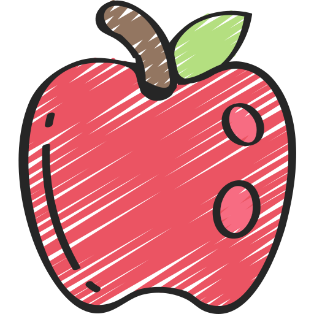

<!-- Copyright notice for this README.md template -->

<!-- MIT License

Copyright (c) 2021 Othneil Drew

Permission is hereby granted, free of charge, to any person obtaining a copy
of this software and associated documentation files (the "Software"), to deal
in the Software without restriction, including without limitation the rights
to use, copy, modify, merge, publish, distribute, sublicense, and/or sell
copies of the Software, and to permit persons to whom the Software is
furnished to do so, subject to the following conditions:

The above copyright notice and this permission notice shall be included in all
copies or substantial portions of the Software.

THE SOFTWARE IS PROVIDED "AS IS", WITHOUT WARRANTY OF ANY KIND, EXPRESS OR
IMPLIED, INCLUDING BUT NOT LIMITED TO THE WARRANTIES OF MERCHANTABILITY,
FITNESS FOR A PARTICULAR PURPOSE AND NONINFRINGEMENT. IN NO EVENT SHALL THE
AUTHORS OR COPYRIGHT HOLDERS BE LIABLE FOR ANY CLAIM, DAMAGES OR OTHER
LIABILITY, WHETHER IN AN ACTION OF CONTRACT, TORT OR OTHERWISE, ARISING FROM,
OUT OF OR IN CONNECTION WITH THE SOFTWARE OR THE USE OR OTHER DEALINGS IN THE
SOFTWARE. -->

<a name="readme-top"></a>

<!-- PROJECT SHIELDS -->
<!--
*** I'm using markdown "reference style" links for readability.
*** Reference links are enclosed in brackets [ ] instead of parentheses ( ).
*** See the bottom of this document for the declaration of the reference variables
*** for contributors-url, forks-url, etc. This is an optional, concise syntax you may use.
*** https://www.markdownguide.org/basic-syntax/#reference-style-links
-->

[![Contributors][contributors-shield]][contributors-url]
[![Forks][forks-shield]][forks-url]
[![Stargazers][stars-shield]][stars-url]
[![Issues][issues-shield]][issues-url]
[![MIT License][license-shield]][license-url]

<!-- PROJECT LOGO -->
<br />
<div align="center">
  <a href="https://github.com/SilentStorm2k/Totodo">
    
  </a>

<h3 align="center">Totodo</h3>

  <p align="center">
    A simple todolist application 
    <br />
    <a href="https://github.com/SilentStorm2k/Totodo"><strong>Explore the docs »</strong></a>
    <br />
    <br />
    <a href="https://silentstorm2k.github.io/ToTodo/">View Demo</a>
    ·
    <a href="https://github.com/SilentStorm2k/Totodo/issues">Report Bug</a>
    ·
    <a href="https://github.com/SilentStorm2k/Totodo/issues">Request Feature</a>
  </p>
</div>

<!-- TABLE OF CONTENTS -->
<details>
  <summary>Table of Contents</summary>
  <ol>
    <li>
      <a href="#about-the-project">About The Project</a>
      <ul>
        <li><a href="#built-with">Built With</a></li>
      </ul>
    </li>
    <li>
      <a href="#getting-started">Getting Started</a>
      <ul>
        <li><a href="#prerequisites">Prerequisites</a></li>
        <li><a href="#installation">Installation</a></li>
      </ul>
    </li>
    <li><a href="#usage">Usage</a></li>
    <li><a href="#roadmap">Roadmap</a></li>
    <li><a href="#contributing">Contributing</a></li>
    <li><a href="#license">License</a></li>
    <li><a href="#contact">Contact</a></li>
    <li><a href="#acknowledgments">Acknowledgments</a></li>
  </ol>
</details>

<!-- ABOUT THE PROJECT -->

## About The Project

A simple todo list application with lots to improve on the UI/CSS front which I am too lazy to work on. Underlying functionality all works including the arrangement of todos wrt date, priority, story points, completed, and projects.

<p align="right">(<a href="#readme-top">back to top</a>)</p>

<!-- GETTING STARTED -->

## Getting Started

You will just run the following command to spin up a local dev environment after the prerequisite steps.

```sh
pnpm run start
```

### Prerequisites

You will need to have node, npm, and pnpm installed
You can refer it from their website https://nodejs.org/en/download, or for linux follow below

-   ```sh
    sudo apt update
    ```
-   ```sh
    sudo apt install -g node, npm
    ```
-   ```sh
    npm install pnpm
    ```
-   Verify your installation by
    ```sh
    pnpm -v
    ```

### Installation

1. Clone the repo
    ```sh
    git clone https://github.com/SilentStorm2k/Totodo.git
    ```
2. Install PNPM packages
    ```sh
    pnpm install
    ```
3. Run a local instance
    ```sh
    pnpm run start
    ```

<p align="right">(<a href="#readme-top">back to top</a>)</p>

<!-- CONTRIBUTING -->

## Contributing

Contributions are what make the open source community such an amazing place to learn, inspire, and create. Any contributions you make are **greatly appreciated**.

If you have a suggestion that would make this better, please fork the repo and create a pull request. You can also simply open an issue with the tag "enhancement".
Don't forget to give the project a star! Thanks again!

1. Fork the Project
2. Create your Feature Branch (`git checkout -b feature/AmazingFeature`)
3. Commit your Changes (`git commit -m 'Add some AmazingFeature'`)
4. Push to the Branch (`git push origin feature/AmazingFeature`)
5. Open a Pull Request

<p align="right">(<a href="#readme-top">back to top</a>)</p>

<!-- LICENSE -->

## License

Distributed under the MIT License. See `LICENSE.txt` for more information.

<p align="right">(<a href="#readme-top">back to top</a>)</p>

<!-- CONTACT -->

## Contact

Raise an issue.
Project Link: [https://github.com/SilentStorm2k/Totodo](https://github.com/SilentStorm2k/Totodo)

<p align="right">(<a href="#readme-top">back to top</a>)</p>

<!-- ACKNOWLEDGMENTS -->

## Acknowledgments

-   [Trashcan icons created by Bombasticon Studio - Flaticon](https://www.flaticon.com/free-icons/trashcan")
-   [Fruit icons created by juicy_fish - Flaticon](https://www.flaticon.com/free-icons/fruit)
-   [Home icons created by Dave Gandy - Flaticon](https://www.flaticon.com/free-icons/home")
-   [open menu icons">Open menu icons created by Pixel perfect - Flaticon](https://www.flaticon.com/free-icons/open-menu")
-   [Add icons created by reussy - Flaticon](https://www.flaticon.com/free-icons/add")
-   [Down arrow icons created by th studio - Flaticon](https://www.flaticon.com/free-icons/up-arrow")
-   [Up arrow icons created by Freepik - Flaticon](https://www.flaticon.com/free-icons/down-arrow")

<p align="right">(<a href="#readme-top">back to top</a>)</p>

<!-- MARKDOWN LINKS & IMAGES -->
<!-- https://www.markdownguide.org/basic-syntax/#reference-style-links -->

[contributors-shield]: https://img.shields.io/github/contributors/SilentStorm2k/Totodo.svg?style=for-the-badge
[contributors-url]: https://github.com/SilentStorm2k/Totodo/graphs/contributors
[forks-shield]: https://img.shields.io/github/forks/SilentStorm2k/Totodo.svg?style=for-the-badge
[forks-url]: https://github.com/SilentStorm2k/Totodo/network/members
[stars-shield]: https://img.shields.io/github/stars/SilentStorm2k/Totodo.svg?style=for-the-badge
[stars-url]: https://github.com/SilentStorm2k/Totodo/stargazers
[issues-shield]: https://img.shields.io/github/issues/SilentStorm2k/Totodo.svg?style=for-the-badge
[issues-url]: https://github.com/SilentStorm2k/Totodo/issues
[license-shield]: https://img.shields.io/github/license/SilentStorm2k/Totodo.svg?style=for-the-badge
[license-url]: https://github.com/SilentStorm2k/Totodo/blob/main/LICENSE.txt
[linkedin-shield]: https://img.shields.io/badge/-LinkedIn-black.svg?style=for-the-badge&logo=linkedin&colorB=555
[linkedin-url]: https://linkedin.com/in/linkedin_username
[product-screenshot]: images/screenshot.png
[Next.js]: https://img.shields.io/badge/next.js-000000?style=for-the-badge&logo=nextdotjs&logoColor=white
[Next-url]: https://nextjs.org/
[React.js]: https://img.shields.io/badge/React-20232A?style=for-the-badge&logo=react&logoColor=61DAFB
[React-url]: https://reactjs.org/
[Vue.js]: https://img.shields.io/badge/Vue.js-35495E?style=for-the-badge&logo=vuedotjs&logoColor=4FC08D
[Vue-url]: https://vuejs.org/
[Angular.io]: https://img.shields.io/badge/Angular-DD0031?style=for-the-badge&logo=angular&logoColor=white
[Angular-url]: https://angular.io/
[Svelte.dev]: https://img.shields.io/badge/Svelte-4A4A55?style=for-the-badge&logo=svelte&logoColor=FF3E00
[Svelte-url]: https://svelte.dev/
[Laravel.com]: https://img.shields.io/badge/Laravel-FF2D20?style=for-the-badge&logo=laravel&logoColor=white
[Laravel-url]: https://laravel.com
[Bootstrap.com]: https://img.shields.io/badge/Bootstrap-563D7C?style=for-the-badge&logo=bootstrap&logoColor=white
[Bootstrap-url]: https://getbootstrap.com
[JQuery.com]: https://img.shields.io/badge/jQuery-0769AD?style=for-the-badge&logo=jquery&logoColor=white
[JQuery-url]: https://jquery.com
